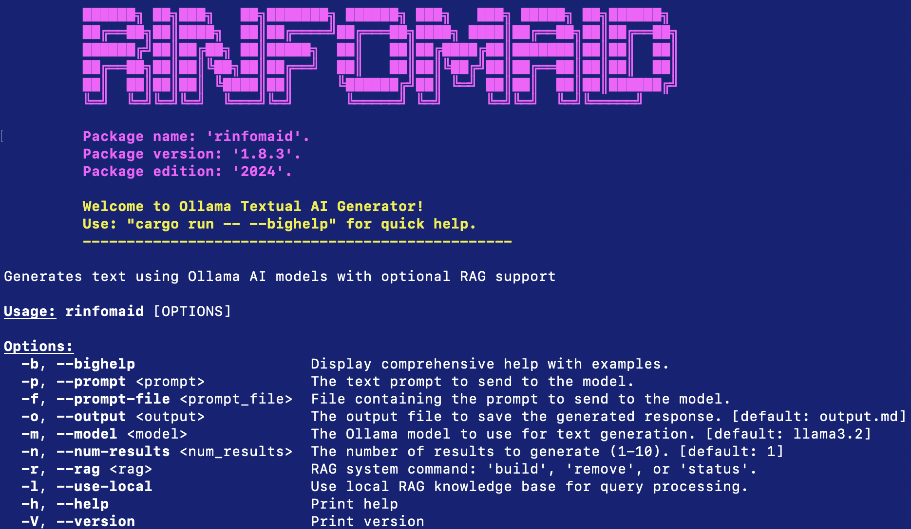

# Rinfomaid:  A textual AI application, markdown archival and RAG document query system written in Rust. Neat-o!, right?


Date: 16 July 2025

[Oliver Bonham-Carter](https://www.oliverbonhamcarter.com/)

Email: obonhamcarter at allegheny.edu

[](https://opensource.org/licenses/MIT)


The **RinfoMaid** is a Rust command-line tool that interacts with the Ollama API to generate text using AI models. The program can either take a prompt from the command line, a prompt file, or ask the user to enter a prompt. It then sends the prompt to the Ollama API and retrieves a generated response, which is saved to a specified output file in markdown format. 

**NEW and Cool:** RinfoMaid now includes **Agentic RAG (Retrieval-Augmented Generation)** functionality! This allows you to build a local knowledge base from your documents (PDF, TXT, MD files) and query them using AI. The system can answer questions using your local documents, saves responses to the `0_out/` directory with automatic file numbering, and falls back to Ollama models when needed. 

**Why did you work on this project?**
This project is a learning tool for how to programming nifty AI stuff in Rust. Cool, right?



## Table of Contents

- [Rinfomaid:  A textual AI application, markdown archival and RAG document query system written in Rust. Neat-o!, right?](#rinfomaid--a-textual-ai-application-markdown-archival-and-rag-document-query-system-written-in-rust-neat-o-right)
  - [Table of Contents](#table-of-contents)
  - [Dependencies](#dependencies)
  - [Rust Compiler Version](#rust-compiler-version)
  - [Installation](#installation)
  - [Usage](#usage)
    - [Standard AI Generation](#standard-ai-generation)
      - [Run with Prompt](#run-with-prompt)
      - [Run with Prompt File](#run-with-prompt-file)
      - [Run with Model](#run-with-model)
    - [RAG (Retrieval-Augmented Generation) Features](#rag-retrieval-augmented-generation-features)
      - [Quick Start with RAG](#quick-start-with-rag)
    - [Building Your Local Knowledge Base](#building-your-local-knowledge-base)
    - [Querying Your Local Knowledge Base](#querying-your-local-knowledge-base)
    - [RAG Management Commands](#rag-management-commands)
  - [Supported File Types](#supported-file-types)
    - [Getting Help](#getting-help)
  - [Explanation of Code](#explanation-of-code)
    - [Main Flow](#main-flow)
    - [Functions](#functions)
    - [RAG System Architecture](#rag-system-architecture)
      - [Core Components](#core-components)
      - [RAG Functions](#rag-functions)
      - [Search Algorithm](#search-algorithm)
      - [File Structure](#file-structure)
  - [Notable Features](#notable-features)
  - [Special Notes](#special-notes)
    - [Definitions of Terms](#definitions-of-terms)
    - [Output File Handling](#output-file-handling)
      - [Standard AI Generation Output](#standard-ai-generation-output)
      - [RAG (Local Knowledge Base) Output](#rag-local-knowledge-base-output)
    - [Ethical Note](#ethical-note)
    - [A Work In Progress](#a-work-in-progress)

## Dependencies
This `README.md` file should provide sufficient context for a user to understand, set up, and use the program.

To run this _RinfoMaid_, you will need to add a few dependencies in your `Cargo.toml` file. These dependencies allow the program to parse command-line arguments, interact with the Ollama API, and handle colored output.

Here are the necessary dependencies:

- **`clap`**: For parsing command-line arguments.
- **`colored`**: For printing colored text to the terminal.
- **`ollama_rs`**: To interact with the Ollama API and generate text.
- **`tokio`**: To support asynchronous execution using `async/await`.

In case they have not already been added, please add the following dependencies to your `Cargo.toml` file under `[dependencies]`:

```toml
[dependencies]
colored = "3.0.0"
clap = "4.5.32"
ollama-rs = "0.2.6"
tokio = {version = "1.44.1" ,features = ["full"]}
toml = "0.8.20"
serde = "1.0.219"
# RAG-specific dependencies
pdf-extract = "0.7.7"
walkdir = "2.5.0"
uuid = "1.11.0"
regex = "1.11.1"
anyhow = "1.0.93"
```

*Note I*: While these dependencies are already included in the `Cargo.toml` file of the project, their versions may change over time. Hopefully, I will get around to updating them periodically.

*Note II*: If you do update your dependencies, then there could be trouble with compiling the code. If you run into issues, open an issue in the repository, submit a pull request with the necessary changes, or revert to the previous versions of the dependencies.

## Rust Compiler Version

This code was compiled using the Rustc version `1.85.0 (4d91de4e4 2025-02-17)`, with Cargo version `1.85.0 (d73d2caf9 2024-12-31)`.

## Installation

1. **Clone the Repository**:

   If you have not already cloned the repository, use the following command:

   ```bash
   git clone git@github.com:developmentAC/rinfomaid.git
   cd rinfomaid
   ```

2. **Add Dependencies**:

   As mentioned in the dependencies section, make sure to include the necessary libraries in your `Cargo.toml` file. You can also use `cargo add` to add the dependencies directly:

   ```bash
   cargo add clap colored ollama_rs tokio
   ```

3. ### Set Up Ollama and its Local Models

   Ollama may be downloaded from [https://ollama.com/](https://ollama.com/). The below commands will install the models that Ollama will require to perform its functions. Note, a typical model for Ollama is about 4 GB in size. There are many different models that you can experiment with at [https://ollama.com/search](https://ollama.com/search).

The default model is `llama3.2`, which you can pull using the following command:

   ``` bash
  ollama pull llama3.2
   ```

Another common (e.g., general purpose) model is `mistral`, which you can pull using the following command:

   ``` bash
  ollama pull mistral
   ```

4. **Build the Project**:

   To build the project, run the following:

   ```bash
   cargo build
   ```

5. **Run the Program**:

   You can run the program using the following command:

   ```bash
   cargo run -- --prompt "What is the capital of France?" --output "result.md" --model "llama3.2"
   ```
_Note: the explainations for these options are provided below._

## Usage

The program supports multiple modes of operation:

### Standard AI Generation

For direct AI text generation using Ollama models, use these command-line arguments:

- **`-p` or `--prompt`**: A direct prompt you want to send to the model (optional).
- **`-f` or `--prompt-file`**: A file that contains the prompt (optional).
- **`-o` or `--output`**: The output file to save the generated response (required).
- **`-m` or `--model`**: The AI model to use for text generation (required). Defaults to "llama3.2".
- **`--num-results`**: Number of results to generate (optional, defaults to 1).

#### Run with Prompt

If you want to provide a prompt directly from the command line, use the `-p` (or `--prompt`) argument:

```bash
cargo run -- -p "What is the capital of Pennsylvania?" -m llama3.2 -o output.md
```

This will generate text based on the provided prompt and save the result in markdown formatting to a created output directory, `0_out/output.md`.

#### Run with Prompt File

You can also provide a prompt from a file using the `-f` (or `--prompt-file`) argument:

```bash
cargo run -- --prompt-file "prompt.txt" --output "result.md" --model "llama3.2"
```

This will read the prompt from the file `prompt.txt`, generate a response, and save it to `result.md`.

#### Run with Model

You can specify the model to use for generation with the `-m` (or `--model`) argument. If not specified, it defaults to `llama3.2`:

```bash
cargo run -- --prompt "What is the capital of France?" --output "result.md" --model "llama3.2"
```

Otherwise, you could use your own model, such as `llama3.2`. In addition, since the one output to another file are likely to differ, you can specify the number of results to generate using the `--num_results` argument:

```bash
cargo run -- --prompt "What is the capital of France?" --output "result.md" --model "llama3.2" --num_results 2
```

### RAG (Retrieval-Augmented Generation) Features

🆕 **NEW FEATURE**: RinfoMaid now includes a powerful RAG system that allows you to build and query a local knowledge base from your documents!

#### Quick Start with RAG

```bash
# 1. Place your documents in the data/ directory
mkdir -p data
cp your_documents.pdf data/

# 2. Build the local knowledge base
cargo run -- --rag build

# 3. Query your documents
cargo run -- --use-local --prompt "What does the document say about...?"

# 4. Check the status of your knowledge base
cargo run -- --rag status
```

### Building Your Local Knowledge Base

To build a local knowledge base from your documents:

```bash
cargo run -- --rag build
```

This command will:
- Scan all PDF, TXT, and MD files in the `data/` directory
- Extract text content and chunk it into manageable pieces
- Build a searchable word index using TF-IDF scoring
- Save the processed model to the `agentic/` directory

### Querying Your Local Knowledge Base

To query your local knowledge base instead of using Ollama directly:

```bash
cargo run -- --use-local --prompt "What is a recycler mower?"
```

You can also specify an output file to save the RAG response:

```bash
cargo run -- --use-local --prompt "What is a recycler mower?" --output "rag_response.md"
```

Features of local querying:
- **Smart Search**: Uses TF-IDF scoring with relevance bonuses for key terms
- **Source Attribution**: Shows which documents were used and their relevance scores
- **File Output**: Saves responses to the `0_out/` directory with automatic file numbering
- **Automatic Fallback**: If the local knowledge base cannot answer the question, it will inform you and suggest using a standard Ollama model

### RAG Management Commands

- **Build Model**: `cargo run -- --rag build` - Creates/updates the local knowledge base
- **Check Status**: `cargo run -- --rag status` - Shows information about your current model
- **Remove Model**: `cargo run -- --rag remove` - Deletes the local knowledge base

**Note**: When using `--use-local` with a prompt, responses are automatically saved to the `0_out/` directory with the same file numbering system as standard Ollama responses. See the [Output File Handling](#output-file-handling) section for more details.

Example status output:
```
Local model is available with 3 documents and 45 chunks
```

## Supported File Types

The RAG system supports the following file types in the `data/` directory:

- **PDF files** (`.pdf`) - Extracts text content from PDF documents
- **Text files** (`.txt`) - Plain text documents
- **Markdown files** (`.md`) - Markdown-formatted documents

**Note**: Place all your source documents in the `data/` directory before running `--rag build`.

### Getting Help

To see all available commands and options, including RAG features:

```bash
cargo run -- --bighelp
```

This will display:

- Standard AI generation options
- RAG commands and usage examples
- Supported file types
- Quick start instructions


## Explanation of Code

### Main Flow

1. **Argument Parsing**:
   - The program starts by using `clap` to parse the command-line arguments. It looks for the following arguments:
     - `prompt`: Direct input for the prompt.
     - `prompt_file`: A file containing the prompt.
     - `output`: The file where the result will be saved.
     - `model`: The AI model to use for text generation.
       - If the `output` argument is not provided, the program will display an error message and exit.
     - num_results is an optional argument that specifies the number of results to generate. If not provided, it defaults to 1.
2. **Input Prompt**:
   - The program checks if the user has provided a prompt via the `-p` or `-f` argument. If neither is provided, the program prompts the user to enter a prompt interactively.

3. **Generate Response**:
   - The program connects to the Ollama API (`http://localhost:11434`) and sends the prompt to the selected model. It waits for the response asynchronously.

4. **Output File Handling**:
   - The program ensures the output directory (`0_out/`) exists and creates it if necessary.
   - If the specified output file already exists, it automatically generates a unique filename by appending a number.
   - If the request is successful, the response is printed in cyan, and the result is saved to the uniquely named output file in markdown format.
   - If the request fails (e.g., the server is not running), an error message is displayed.

### Functions

- **`parse_arguments()`**: This function sets up the command-line argument parsing using `clap`. It defines the expected arguments and their descriptions.
- **`get_prompt()`**: This function retrieves the prompt. It checks if a prompt is provided as a command-line argument or a file. If not, it asks the user for input.
- **`generate_response()`**: This asynchronous function sends the prompt to the Ollama API and retrieves the response.
- **`generate_unique_output_path()`**: This function ensures the output directory exists and generates a unique filename by adding numbers if the file already exists.
- **`handle_success()`**: This function handles the success case for standard Ollama responses. It prints the response in cyan and saves it to the output file.
- **`handle_success_local_rag()`**: This function handles the success case for local RAG responses. It saves the response to the output file with special formatting and source attribution.
- **`handle_failure()`**: This function prints an error message if the request to Ollama fails.
- **`get_input()`**: This function prompts the user for input when no prompt is provided.
- **`colour_print()`**: A utility function that prints text in different colors using the `colored` crate.

### RAG System Architecture

The RAG (Retrieval-Augmented Generation) system consists of several key components:

#### Core Components

- **`RagSystem`**: Main struct that manages documents, chunks, and the search index
- **`Document`**: Represents a source document with metadata and content
- **`DocumentChunk`**: Represents a chunked piece of a document for efficient searching
- **Word Index**: A HashMap-based inverted index for fast text search

#### RAG Functions

- **`build_local_model()`**: Processes documents in the `data/` directory and builds the knowledge base
- **`load_model()`**: Loads a previously built model from the `agentic/` directory
- **`save_model()`**: Persists the current model to disk in JSON format
- **`search_local()`**: Performs TF-IDF-based search across document chunks
- **`process_pdf()`**: Extracts text content from PDF files
- **`process_text_file()`**: Processes plain text and markdown files
- **`chunk_text()`**: Splits documents into manageable chunks for indexing
- **`build_word_index()`**: Creates an inverted index for efficient text search

#### Search Algorithm

The RAG system uses an enhanced TF-IDF (Term Frequency-Inverse Document Frequency) algorithm:

1. **Tokenization**: Text is split into words and normalized (lowercase, alphanumeric only)
2. **TF Calculation**: Counts how often a term appears in each document chunk
3. **IDF Calculation**: Measures how common or rare a term is across all documents
4. **Scoring**: Combines TF and IDF with bonus weights for important terms
5. **Ranking**: Results are sorted by relevance score and returned with source attribution

#### File Structure

```text
agentic/
├── documents.json    # Document metadata and content
├── chunks.json       # Text chunks for searching
└── word_index.json   # Inverted index for fast search
```

## Notable Features

This project demonstrates how to interact with an AI model to generate text using the Ollama API, enhanced with powerful RAG (Retrieval-Augmented Generation) capabilities. The tool is flexible, allowing users to:

- **Generate text** using various Ollama models with prompts from command line, files, or interactive input
- **Build local knowledge bases** from PDF, TXT, and MD documents
- **Query local documents** using intelligent search with TF-IDF scoring
- **Get source attribution** with relevance scores for transparency
- **Seamlessly integrate** local knowledge with cloud-based AI models

The RAG system makes RinfoMaid particularly powerful for:

- **Document Q&A**: Answer questions about your specific documents
- **Research**: Quickly find relevant information across multiple documents
- **Knowledge Management**: Build searchable repositories of your documents
- **Educational Use**: Learn about AI, document processing, and information retrieval

All results are saved in markdown format, making it easy to view and share the generated responses.

If you have any issues or suggestions, feel free to open an issue in the repository or submit a pull request.

---

## Special Notes

**When uising Ollama**: Ensure that the Ollama server is running on `http://localhost:11434` for the program to work.
 
### Definitions of Terms

- **Dependencies**: This section outlines the necessary dependencies for the project and shows how to add them to the `Cargo.toml` file.
- **Installation**: Describes how to clone the project, install the dependencies, and build the project.
- **Usage**: Shows examples of how to run the program with different configurations (direct prompt, file prompt, specifying model, and RAG features).
- **RAG (Retrieval-Augmented Generation)**: A technique that combines information retrieval with text generation. The system retrieves relevant documents and uses them to generate more accurate, context-aware responses.
- **TF-IDF**: Term Frequency-Inverse Document Frequency, a numerical statistic used to reflect how important a word is to a document in a collection of documents.
- **Document Chunking**: The process of breaking large documents into smaller, manageable pieces for efficient indexing and searching.
- **Local Knowledge Base**: A collection of processed documents stored locally that can be queried without requiring internet access.
- **Explanation of Code**: Provides an overview of the main flow and the functions in the code to help users understand how the program works.

### Output File Handling

🆕 **NEW FEATURE**: RinfoMaid now automatically handles output file conflicts for both standard and RAG responses!

#### Standard AI Generation Output

- **Directory Creation**: The `0_out/` directory is automatically created if it doesn't exist
- **File Conflict Resolution**: If the specified output file already exists, RinfoMaid will automatically append a number to create a unique filename
- **Examples**:
  - First run: `output.md` → saves to `0_out/output.md`
  - Second run: `output.md` → saves to `0_out/output_1.md`
  - Third run: `output.md` → saves to `0_out/output_2.md`
  - Works with any extension: `report.txt` → `report_1.txt` → `report_2.txt`
  - Works without extensions: `myfile` → `myfile_1` → `myfile_2`

#### RAG (Local Knowledge Base) Output

When using the `--use-local` flag, RAG responses are also saved to files with the same robust file handling:

- **Automatic File Saving**: RAG responses are automatically saved to the `0_out/` directory
- **Unique File Naming**: Uses the same numbering system as standard Ollama responses
- **Enhanced Formatting**: RAG output files include:
  - Special header indicating "Local RAG Generation Result"
  - Model information showing "llama3.2 (local RAG)"
  - Source attribution with relevance scores
  - Structured markdown formatting

**Example RAG file output:**
```bash
# Running RAG queries
cargo run -- --use-local --prompt "What is maintenance?" --output "rag_query.md"
cargo run -- --use-local --prompt "Tell me about safety" --output "rag_query.md"
```

This creates:
- `0_out/rag_query.md` (first query)
- `0_out/rag_query_1.md` (second query with same filename)

**Sample RAG file content:**
```markdown
# Local RAG Generation Result

## Model: llama3.2 (local RAG)

## Prompt
What is maintenance?

## Response 1
📚 **Local Knowledge Base Response:**
[Generated response with local context]

**Sources used:**
  1. Document_Name.pdf (Relevance: 0.8431)
  2. Another_Document.txt (Relevance: 0.7652)
```

This ensures that previous results are never overwritten and all outputs are preserved, whether they come from standard Ollama models or local RAG queries.


### Ethical Note

While there is a lot of convenience in using AI to prepare drafts of letters and other communications, in all this automation, it is important to have a human presence to preside over the generated textual (or graphical work). While AI systems excel at processing vast amounts of data and executing tasks with remarkable efficiency, they lack the nuanced understanding and ethical judgment inherent to human cognition, in addition to the sense of ethics that ought to come from the human world.

Involving ethics in decisions where machines have made the choices (as strange as that may seem) is essential in domains involving communication. Human oversight ensures that communications, whether they involve customer interactions, inter-office correspondence, or public statements, adhere to ethical standards, tone, and context sensitivity. In addition, decisions influenced by AI algorithms must be subjected to human judgment before implementation. Human evaluators can consider broader implications, ethical ramifications, and potential biases that AI systems might overlook. This "human-touch" can therefore help to safeguard against the potential and unintended consequences which may occur at the intersection of data and decision-making, to name one such area.

With this in mind, the _RInfomaid_ project must be used responsibly. The project is to serve educational purposes -- it is to instruct on the uses of AI, allow for discovery and to entertain (in a way!). Please use _RInfomaid_ responsibly.

---

### A Work In Progress

Check back often to see the evolution of the project!! _RInfomaid_ is a work-in-progress. Updates will come periodically.

If you would like to contribute to this project, **then please do!** For instance, if you see some low-hanging fruit or task that you could easily complete, that could add value to the project, then I would love to have your insight.

Otherwise, please create an Issue for bugs or errors. Since I am a teaching faculty member at Allegheny College, I may not have all the time necessary to quickly fix the bugs. I welcome the OpenSource Community to further the development of this project. Much thanks in advance.

If you appreciate this project, please consider clicking the project's _Star_ button. :-)
